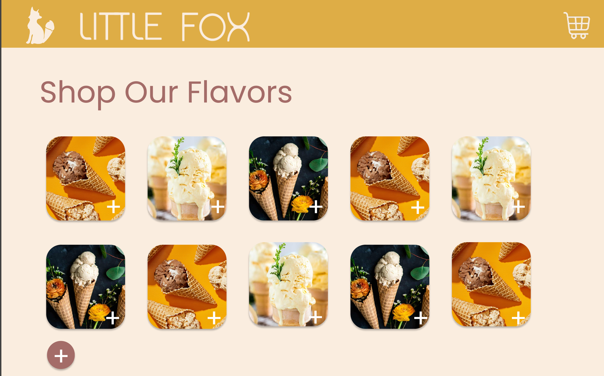
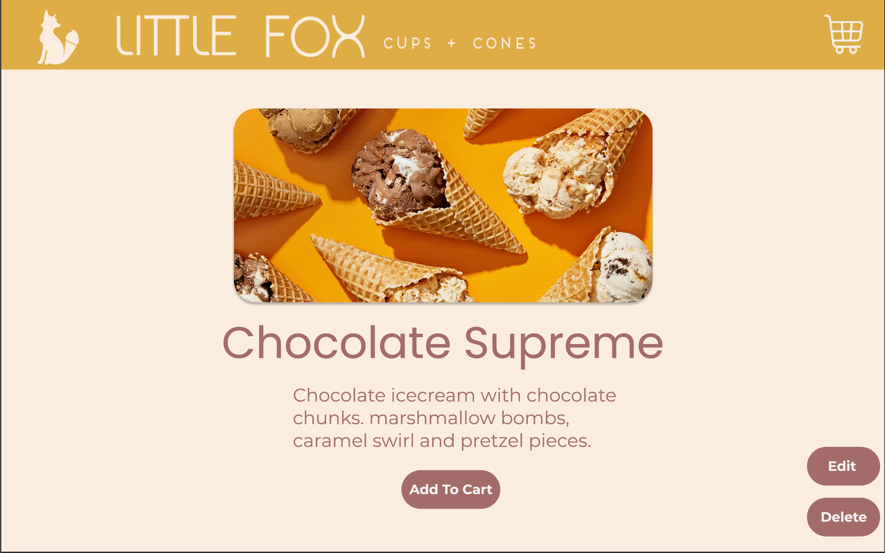

# Little Fox Cups and Cones 

## Problem
My sister has an ice cream business called Little Fox Cups and cones. She needs a website for customers to go to:
- find out information about the buisiness such as hours and location
- see all of the available flavors
- place online orders for pickup. 

## User Stories
### As a customer of the site I would like to be able to:
- find out more about Little Fox such as hours and location
- view all of the icecream flavors and add them to a cart
- view my cart and add or delete items
- place an order for pickup 
- cancel my orders
- write a review 

### As an Admin of the site I would like to be able to:
- add new flavors and have them display on the menu 
- have the ability to mark flavors as out of stock so that no one can add them to their order
- edit flavors' descriptions and prices if there are any changes
- view my current orders (and mark them as completed?)
- delete icecream flavors that are not in season

## Routes
### General 
- `get /` - main page of the site, carousel of images giving the vibe of the shop
- `get /about` - about the shop, location, hours
### Flavors 
- `get /flavors` - see all of the icecream flavors  
- `get /flavors/:id` - see the details of one specific icecream flavor
- `get /flavors/new` - fill out a form to create a new icecream flavor 
- `post /flavors` - add new icecream flavor, redirect to main flavors page
- `get /flavors/:id/edit` - fill out a form to change the details of a specific icecream flavor
- `put /flavors/:id/` - submit the edited details of a specific icecream flavor
- `delete /flavors/:id` - delete a specific icecream flavor 
- `post /flavors/:id/add` - adds a specific flavor to a customers cart 
### Cart 
- `get /cart` - see all of the items in your cart (and the quantity?)
- `delete /cart/:id` - remove an item from your cart 
- `post /cart/place-order` - submit your order for pickup 
### Orders
- `get /user/:id/orders` - see all of your past orders 
- `get /orders/active` - admin view of all orders that need to be filled and when

## Models
### icecream
```
{
    flavor: {type: String, unique: true, required: true},
    description: String,
    price: {type: Number, required: true, min: 0}, 
    available: {type: Boolean, default: true},
    allergens: Array  
}
```
### users
```
{
    username: {type: String, unique: true, required: true},
    isAdmin: {type: Boolean, default: false},
    password: {type: String, required: true}
}
```
### orders 
```
{
    orderName: {type: String, required: true},  
    items: Array,
    pickupTime: Timestamp,
    orderAmount: Number, 
    submitted: {type: Boolean, default: false},
    filled: {type: Boolean, default: false},
}
```

## Wireframe




